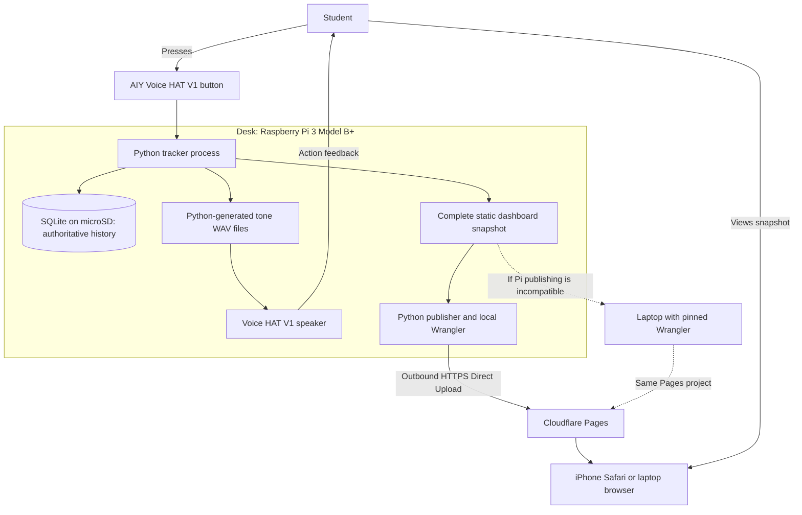
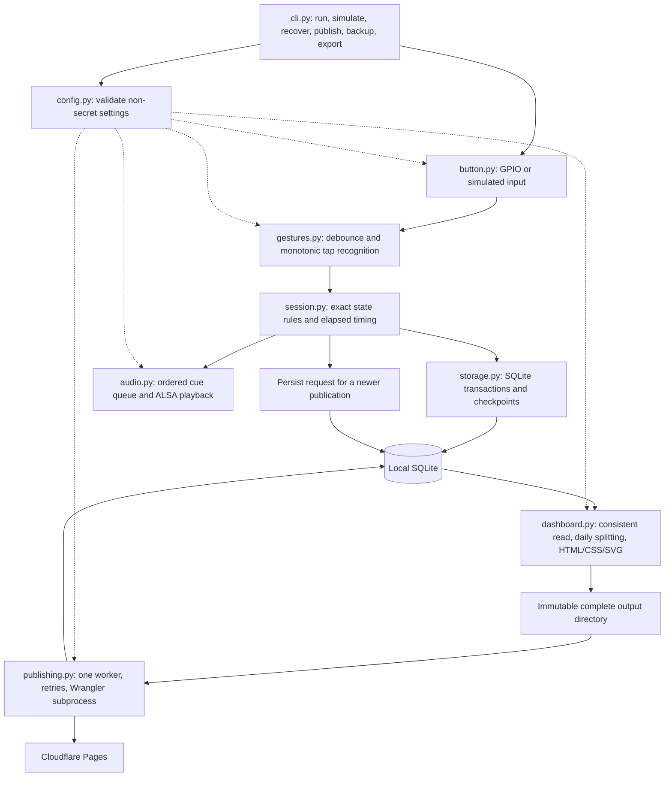
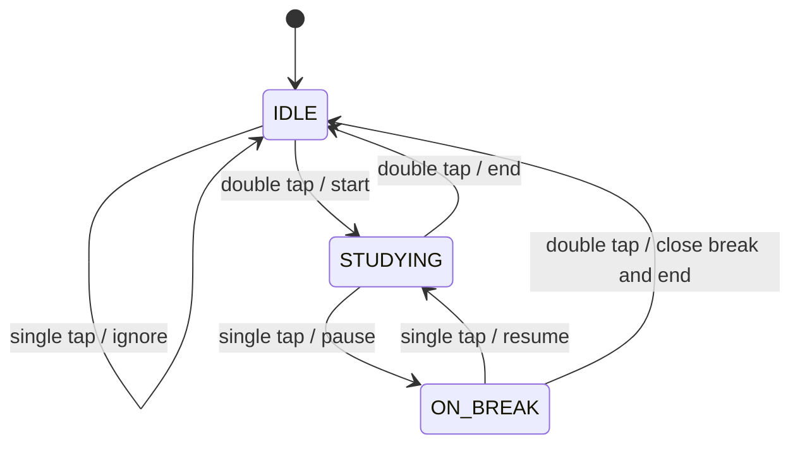
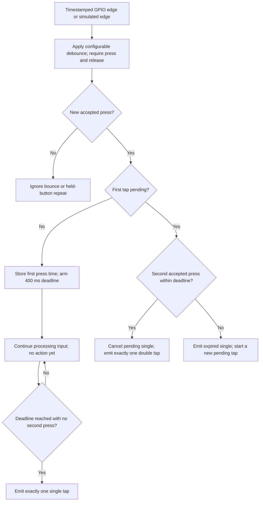
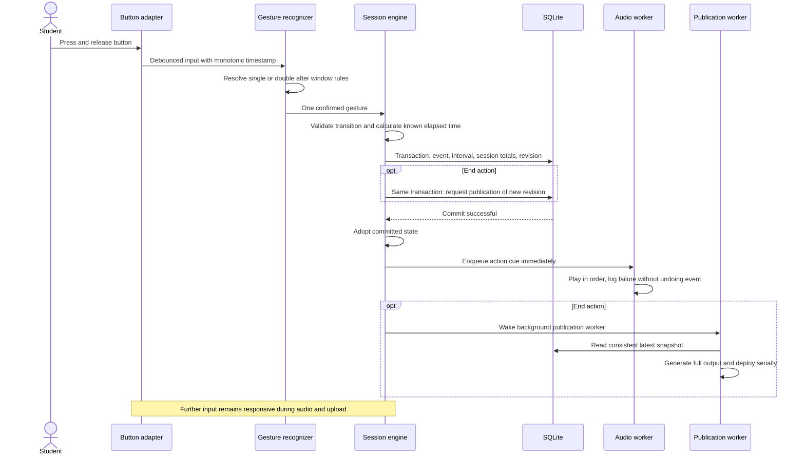
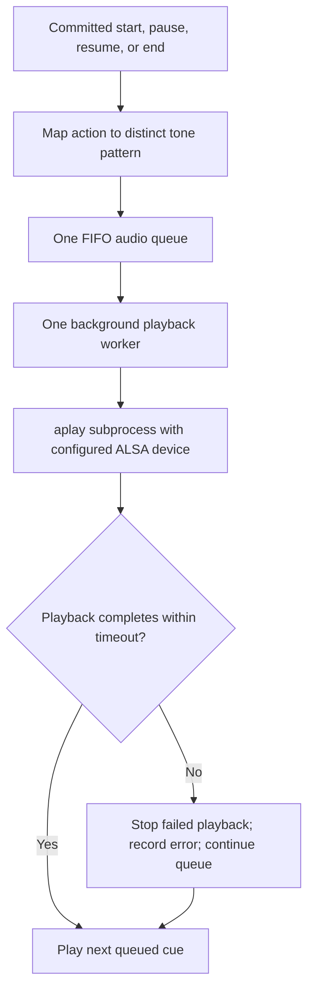
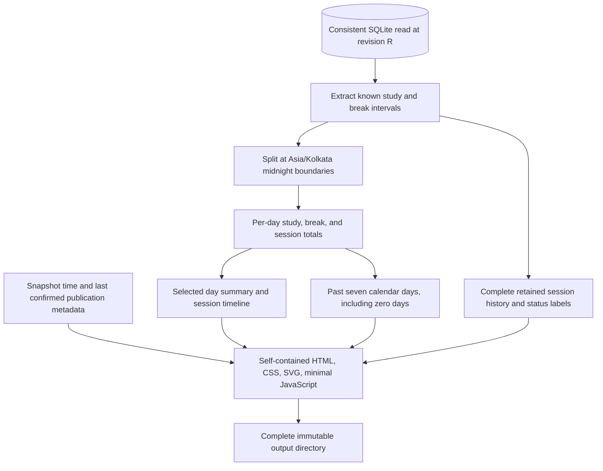

# Tracker architecture and event flow

This is the proposed first-version architecture. Boxes labelled as modules and commands describe future application components; they have not been implemented. Authoritative external setup facts are linked from the existing hardware and publishing guides.

## System context

Only the Pi stores the authoritative database. Pages stores published browser assets, with the intended history embedded in them. Browser requests go to Cloudflare, not to the Pi. The laptop path is a publication fallback, with tracking still on the Pi.

## Module boundaries

These names describe responsibilities, not a rigid requirement to create one file per box. Keep small functions and simple interfaces. Hardware adapters provide input facts; they do not decide which tap starts or ends a session. Simulation exercises the same gesture and session logic.

## Runtime ownership and responsiveness

One tracking loop owns the session state and orders confirmed gestures. GPIO callbacks enqueue timestamped edges quickly. They do not play audio, render pages, or start uploads. Gesture scheduling uses monotonic time and never waits for an audio or deployment worker.

SQLite writes are short, immediate transactions. Commit the accepted action before updating the visible in-memory state or enqueueing the confirmation cue. If storage fails, do not signal a saved action or silently advance state: report the fault and stop accepting new session mutations until persistence is available. Audio and deployment failures cannot roll back a committed action.

Use one ordered audio worker and one publication worker. The latter serializes dashboard generation and uploads and can read a consistent database snapshot without holding a write transaction through rendering or network calls. Avoid a worker or connection per tap. Each SQLite connection belongs to its owner thread; use short transactions and busy timeouts rather than sharing a connection unsafely.

## Session state machine

Recovery is an operational gate, separate from these three user states. An unresolved interrupted session prevents a new start; it does not introduce a fourth button state. [Recovery lifecycle](data-and-recovery.md#startup-and-recovery) explains how the process reaches a trustworthy state before enabling gestures.

## Gesture recognition

Press timestamps use the monotonic clock. Define the boundary as a second accepted press at or before the deadline producing a double tap. Process queued edges through that deadline before resolving its timer, so event-loop scheduling does not change recognition. Events later than the deadline start another tap after the expired single is dispatched. A confirmed double consumes its two taps; a third tap starts a new candidate.

The recognizer must see release before another press is eligible. Debounce and double-tap detection are separate concerns. A configurable initial debounce proposal is 50 ms; the double-tap default is the required 400 ms. Automated boundary and bounce tests use a fake clock.

## What a button action does

The ignored IDLE single tap exits before any transaction or cue. For end-on-break, the transaction closes the break and session together. The end cue is scheduled before rendering/upload work begins; the loop does not wait for the speaker to finish.

## Audio design

Generate reusable WAV files at setup with Python's standard library and a configurable amplitude. Use a V1-compatible output format and explicitly selected ALSA device. No two cues play together. Playback has a finite timeout so a hung subprocess cannot block all later cues. Tracking data remains valid if the queue or device fails; cues do not survive a reboot as a promise of new actions. [V1 audio checks](voice-hat.md) document the hardware-specific evidence.

## Dashboard structure

Default to the latest local day in the snapshot; allow selecting other available days. Show study and break durations distinctly. A session spanning midnight appears in each touched day's detail, with its full session endpoints clearly distinguished from that day's clipped contribution. Proposed daily session count is the number of distinct sessions with a known interval touching that day; the history table still counts each session once.

Uncertain recovery gaps are visibly separate and contribute to neither total. If manual publication includes an ongoing session, render only durations persisted through its checkpoint and label them incomplete/as-of that checkpoint. Never use a browser timer to make a static snapshot appear live. Include a clear snapshot notice and distinguish generation time from successful publication time as described in [publication architecture](publication-architecture.md#publication-timestamps).

Keep assets local, text readable without zooming, controls touch-friendly, and tables scrollable at narrow widths. Use semantic HTML and accessible labels for SVG charts; colour must not be the only distinction between study, break, and interruption. Escape any configurable text inserted into HTML. Do not embed tokens or database files.

## Verification plan

| Area | Required evidence |
| --- | --- |
| State rules | Every transition, ignored IDLE single, end while studying and on break |
| Gestures | Delayed single, only one action per double, exact window boundary, third tap, bounce, held press |
| Durations | Fake monotonic clock, active/break sums, multiple daily sessions, wall-clock changes |
| Calendar | Asia/Kolkata midnight splits, break crossing midnight, zero-activity dates |
| Persistence | Immediate event commit, atomic end-on-break, transaction failure, checkpoint durability |
| Recovery | Unfinished detection, close at checkpoint, resume with gap excluded, no reboot clock reuse |
| Audio | Ordered non-overlap, configured device/volume, failure and timeout isolation |
| Publication | Failed upload retains history/pending state, bounded retries, restart retry, coalescing, one uploader |
| Dashboard | Representative ended-on-break and midnight samples; iPhone-sized layout; credentials absent |
| Operations | Non-root Pi service, safe backup/export, real button/audio checks and ARM64 tooling checks |

Unit tests use fake clocks and mock input, audio, and upload calls, with no real sleeps, Pi, or credentials. Later browser checks inspect a generated sample snapshot. Pi and Cloudflare acceptance checks are recorded separately from mocks. [Current verification record](verification.md) lists only checks already performed.
