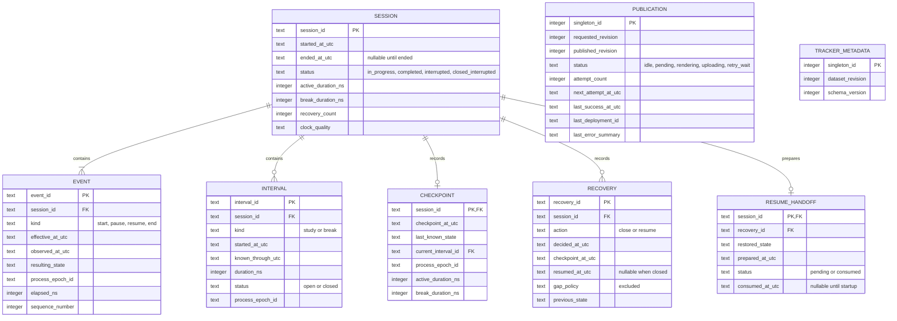
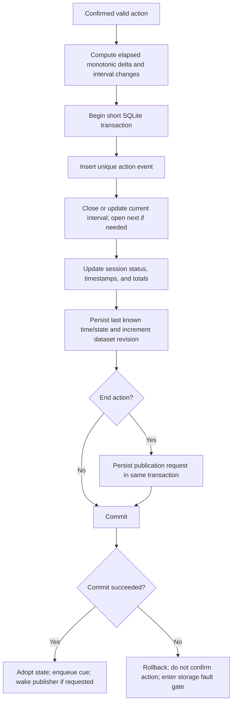
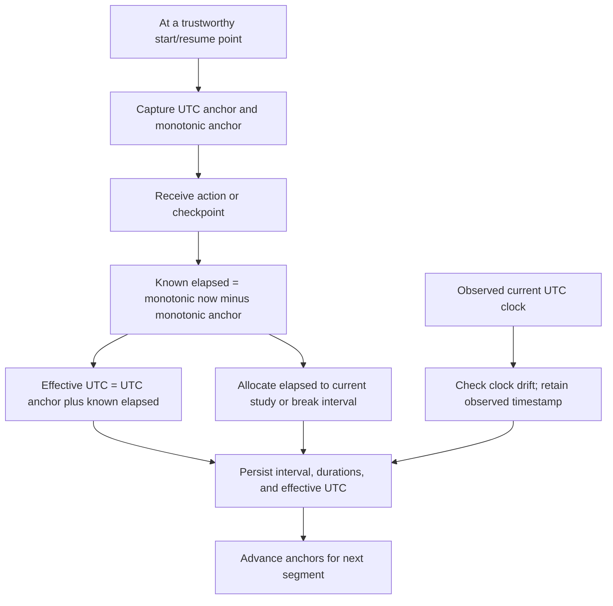
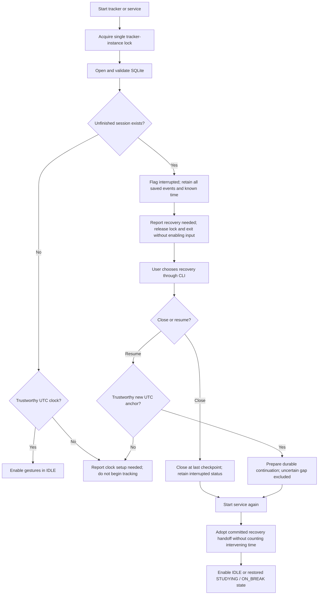
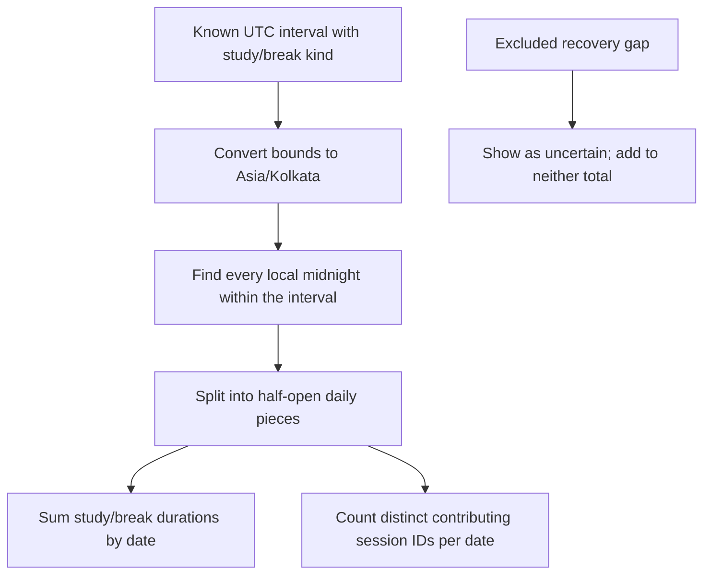

# Data, timing, and interrupted-session recovery

The following is a proposed SQLite model and recovery policy. It describes intended behaviour; no database schema, recovery command, or tracker code has been implemented yet.

## Durable records

Use generated UUIDs for session/event/interval/recovery identifiers. UTC fields are timezone-aware ISO 8601 values, consistently using `Z` or `+00:00`; do not store naive local timestamps. Integer nanoseconds avoid accumulated floating-point rounding. The exact field names may change when the implementation spec is finalised.

There may be at most one unfinished session for this single-user device. Sequence numbers order its events; unique event identifiers prevent duplicate processing from creating repeated records. Constraints validate event kinds, statuses, and non-negative durations. Normal completion sets an end timestamp; an interrupted closure uses the last known checkpoint endpoint and retains its interrupted label.

Events document actions. Intervals document accounted time, including segments created by recovery. Cached session totals must equal the sum of known interval durations and are updated in the same transaction. Checkpoints update known time without inventing pause/resume events. A recovery audit row distinguishes a recovery choice from a physical button press.

## Transaction boundary

Atomic end-on-break prevents an ended session retaining a logically open break. The publication request is durable before the worker is notified, so a crash between saving and notifying does not lose the pending upload.

Use SQLite foreign keys and durable transactions. A proposed WAL setup with `synchronous=FULL` keeps reads practical while preserving committed writes as far as the filesystem and card permit. SQLite cannot guarantee survival of physical media failure. Backups use its online backup API rather than copying only a live `.db` while ignoring WAL contents.

## Monotonic time and UTC

Normal operation counts monotonic differences, not wall-clock subtraction. Anchor the accounted interval timeline to UTC so its endpoint span agrees with its elapsed duration. Keep an observed UTC timestamp for diagnosing wall-clock adjustments; never add a clock jump as extra study time. Significant wall-clock changes need an explicit quality flag and handling rather than quietly shifting already stored history.

A process epoch identifier marks each new runtime. Stored monotonic values are diagnostic only outside their epoch: neither a reboot nor a restarted process may subtract an old anchor from the new monotonic clock. The new runtime continues from persisted cumulative durations after a recovery choice.

The Pi 3 has no battery-backed RTC. After an offline reboot, the current UTC clock may be untrustworthy. Proposed policy: allow inspection and checkpoint closure from saved data, but require a trustworthy UTC anchor before starting or resuming tracking. That anchor can come from synchronisation or an explicitly corrected clock. This operational policy needs confirmation; do not claim that offline reboot automatically preserves timestamp accuracy. Offline tracking during an already anchored runtime remains available.

## Checkpoints and shutdown

Persist every confirmed event immediately. Also persist an active-session checkpoint periodically so recovery does not lose everything since the last tap. A proposed configurable default is 30 seconds; this bounds nominal unaccounted tail time while keeping microSD writes moderate. It does not claim that every millisecond before power loss is recoverable.

On a clean process stop, save a final known checkpoint if storage is working. Do not automatically end the session or fabricate an end event. A subsequent process start still requires recovery for an unfinished session, even if only the process, rather than the Pi, restarted.

## Startup and recovery

The future noninteractive service must not wait on a hidden stdin prompt or restart repeatedly while recovery is pending. Proposed systemd policy is `Restart=on-failure`; recovery-needed exits successfully with a clear log/status marker. A separate foreground recovery CLI acquires the same tracker lock before mutating history. If the normal tracker is running, recovery refuses to race with it.

The CLI shows the session ID, last saved state, last checkpoint time, accounted study/break totals, and the uncertain gap. It offers one of two explicit choices:

- **Close at checkpoint:** close the known interval and session at the checkpoint, preserve saved actions, append the recovery audit, and mark the session `closed_interrupted`.
- **Resume excluding the gap:** preserve the session ID and accounted totals, close the old known interval at its checkpoint, and prepare a continuation in the saved state. Resuming an interrupted break remains ON_BREAK. Append the recovery audit and exclude the unknown gap from both totals. The next service startup opens the continuation interval at its new trustworthy anchor.

A resume choice prepares a one-use durable handoff consumed by the next service startup. That startup establishes its own clock anchors and begins the new segment; it does not count the time spent between the CLI choice and process startup. If the handoff is never consumed, or the service fails again, it remains visible as pending recovery/resume rather than pretending study has continued. Exact handoff fields are an implementation detail to settle with the recovery tests.

No recovery route silently counts time from the final checkpoint through power-off, boot, or user decision. There may be some real activity between the final checkpoint and failure that cannot be known; represent it as uncertain, not recovered study time.

## Split time across local dates

Use half-open intervals `[start, end)` so an endpoint exactly at midnight does not count activity in the next day. Split each known segment independently; never include a recovery gap in a session-wide start-to-end subtraction.

For example, a session studies from 23:50 to 00:10 India time, takes a break from 00:10 to 00:20, then ends with a double tap during the break. Its first date receives 10 study minutes. Its second receives 10 study minutes and 10 break minutes. The history table contains one session with 20 active minutes and 10 break minutes. With the proposed daily-count policy it contributes one session to each date.

## Backup and CSV export

Future CLI commands expose database backup and CSV export through the persistence module. Backups preserve events, intervals, checkpoints, recovery audits, and publication state. CSV exports label timestamps/timezone, statuses, and excluded gaps clearly; they are reports, not replacement authoritative storage. Keep both out of the public repository. These command names and options will be documented when implemented.
