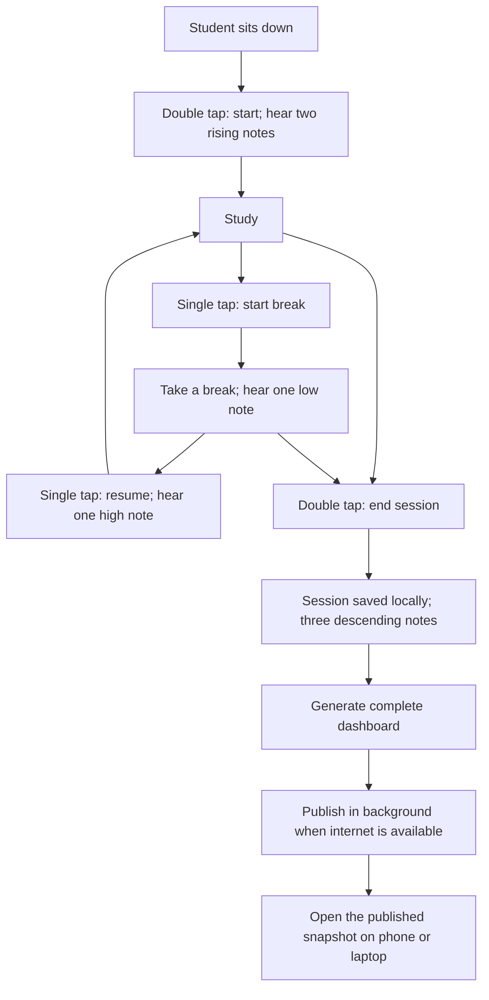
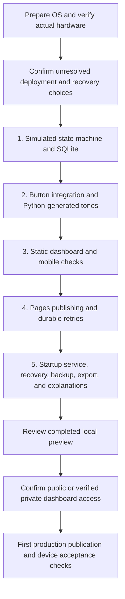

# Python desk study tracker: project document

This document describes the complete intended first version. It is a design, not a claim that the tracker exists. The repository currently contains setup guides and pinned publishing tools. Application implementation, physical verification, and dashboard publication are outside the current documentation task.

## Purpose

Help a first-year Electronics and Communication student see how much time he actually studies and spends on breaks. A physical button on his desk should make tracking easier than opening a phone app. The Python code should remain understandable enough to learn from and extend throughout college.

The device is a Raspberry Pi 3 Model B+ with 1 GB RAM, a 32 GB microSD card, and a Google AIY Voice Kit V1 Voice HAT, button, and speaker. A lightweight Cloudflare Pages dashboard provides access from iPhone Safari and a laptop.

## The experience

A single tap is confirmed only after the configurable double-tap window expires, initially 400 milliseconds. A confirmed double tap causes exactly one action. The first press of an ending double tap must not pause or resume the session.

Sessions can start and end at any time, including weekends, and there can be several in a day. The student's usual weekday evening routine is context only. No schedule ends a session at 8 p.m., 10 p.m., or any other time.

## Exact button rules

| Current state | Confirmed gesture | Action | New state |
| --- | --- | --- | --- |
| IDLE | Single tap | Ignore; no event or action tone | IDLE |
| IDLE | Double tap | Start a new session | STUDYING |
| STUDYING | Single tap | Start a break | ON_BREAK |
| ON_BREAK | Single tap | Finish the break and resume | STUDYING |
| STUDYING | Double tap | End the session | IDLE |
| ON_BREAK | Double tap | End the session and current break | IDLE |

The corresponding tones are two rising notes for start, one low note for pause, one high note for resume, and three descending notes for end. Python generates the WAV assets locally; playback is asynchronous and ordered.

## What the first version includes

SQLite is the authoritative local record. Every accepted start, pause, resume, and end event is saved immediately with unique event/session identifiers and timezone-aware UTC timestamps. Session records expose start/end, active and break totals, and status. Runtime elapsed durations use a monotonic clock. Recovery excludes uncertain time after a shutdown.

The dashboard includes selected-day active time, break time, session count, session start/end times, a study/break timeline, seven-day daily totals, and a history table. Interrupted and unfinished sessions are labelled. Dates and display times use Asia/Kolkata. Intervals crossing local midnight are split between dates.

The published dashboard is a snapshot. It receives new records after a successful deployment, and remains available while the Pi is off. The end gesture saves locally, schedules its tone immediately, requests a fresh dashboard, and queues background publication. A manual publish command uses the same queue. Offline or failed publication retains the data and durable pending state.

Python modules cover configuration, input/gestures, session state/timing, persistence, audio, dashboard generation, publishing/retries, and CLI entry points. Browser assets use HTML, CSS, and minimal JavaScript, with self-contained CSS/SVG visualisations.

## Delivery and learning path

Each later milestone includes meaningful tests and explanations. This diagram describes future work; the current task stops at documentation. See [architecture](architecture.md) for module and event diagrams, [data and recovery](data-and-recovery.md) for durable records and timing, and [publication architecture](publication-architecture.md) for offline operation and upload ordering.

## Boundaries

Do not add AI, extra sensors, a frontend framework, a cloud database, inbound remote access, port forwarding, a tunnel, or another hosting provider. Do not replace the exact button rules with a Pomodoro schedule. Node runs Wrangler only; application logic stays in Python.

Public repository visibility is already selected. Personal dashboard visibility remains undecided. Real history, credentials, generated dashboards, and databases stay outside Git. Read [the repository guide](repository.md) for contribution and privacy conventions.

## Choices and evidence still needed

The intended architecture is complete enough to discuss, but a diagram cannot establish hardware compatibility. The actual OS release, architecture, V1 audio device, button wiring, hardware permissions, and ARM64 Wrangler operation must be checked using [setup](setup.md), [Voice HAT verification](voice-hat.md), and [publishing prerequisites](publishing.md).

The architecture proposes a configurable 30-second checkpoint interval, a per-day session count based on sessions with a known interval on that day, and exponential retry delays capped at five minutes. These are documented proposals, not interview answers. Exact retry/checkpoint defaults, timestamp presentation, licence, dashboard visibility, and any private Access configuration remain to be confirmed before implementation/publication as appropriate.

## Definition of complete, later

The future project is complete when its runnable source, pinned dependencies, example configuration without secrets, non-root service setup, simulation flow, hardware verification, troubleshooting, database backup, CSV export, and beginner walkthrough are present. Tests must cover the [verification plan](architecture.md#verification-plan), and acceptance records must distinguish laptop checks, Pi checks, and actual Cloudflare deployment checks.
