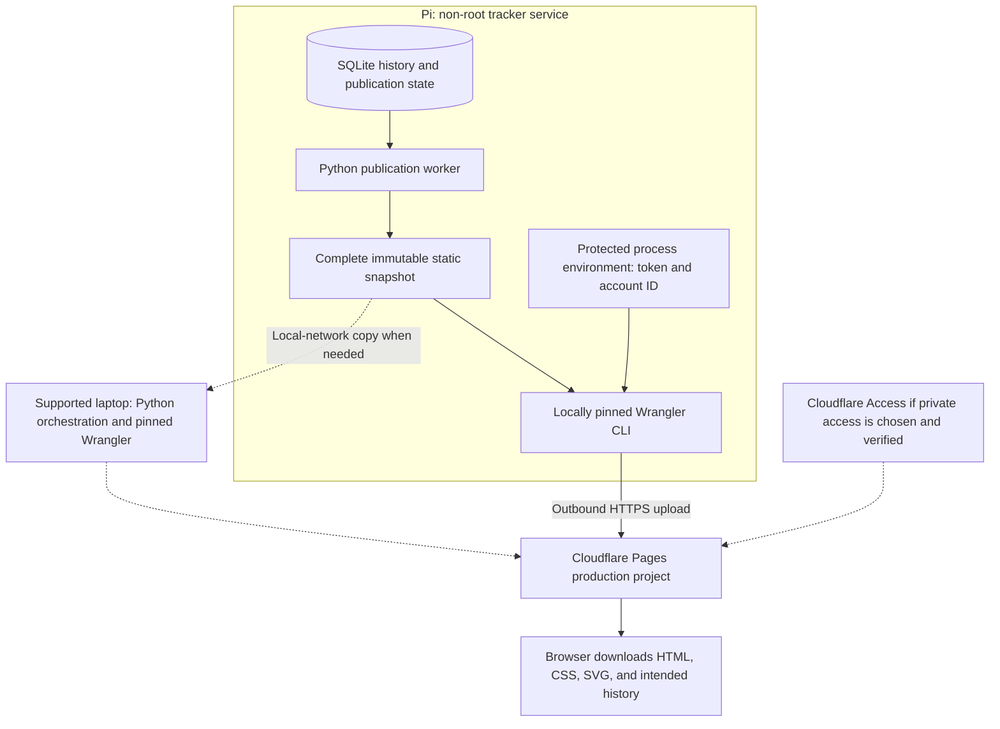
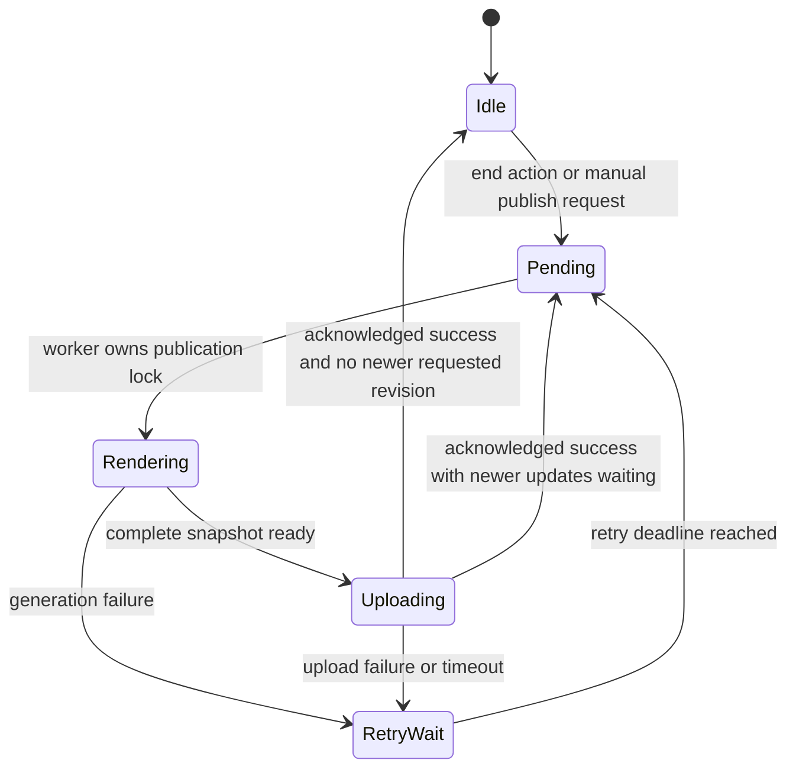
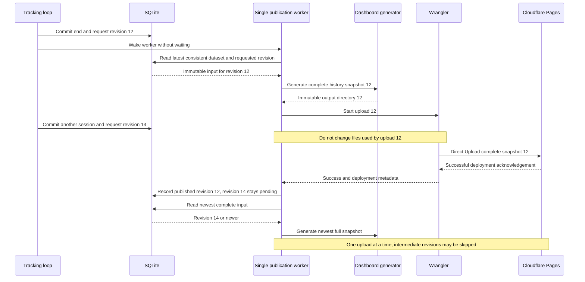
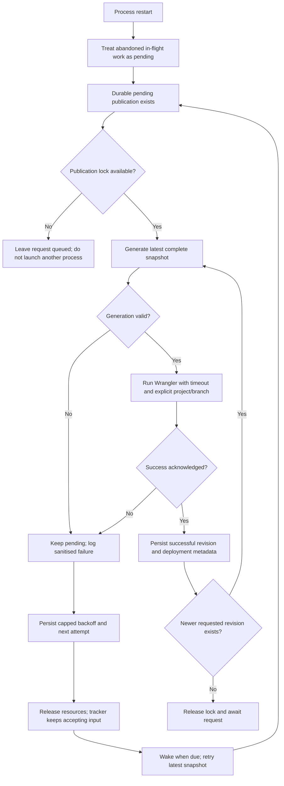
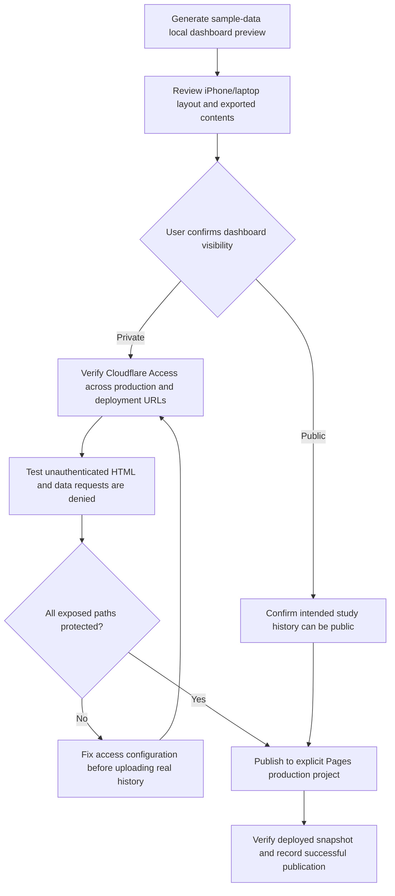

# Dashboard generation and publication architecture

This design keeps tracking local and makes Cloudflare Pages a published snapshot. No dashboard or Cloudflare deployment exists yet. See [publishing prerequisites](publishing.md) for verified CLI flags, proposed tool versions, and setup sources.

## Deployment topology

Credentials are process inputs, never snapshot data. The browser needs no token and no connection to the Pi. The public GitHub repository contains source and documentation, not real session history. A private dashboard would require protecting every accessible hostname and history asset, not just its visible landing page.

## Durable publication state

Persist requested and published dataset revisions, retry count/deadline, last confirmed success, and a sanitised error summary in SQLite. Every normal end transaction requests a publication revision before commit. A manual request updates the same durable state and wakes the same worker.

Only one process holds the publication lock. Normal tracking and CLI requests may enqueue updates concurrently, but cannot launch another upload. A standalone manual publisher may own that lock when the service is absent; it must refuse or just queue the request if another uploader owns it. Process-owned locks release after a crash; durable pending intent does not.

Metadata updates do not increment the dataset revision or trigger a fresh upload by themselves. Otherwise recording an upload success could create an endless publication loop.

## Coalescing and snapshot consistency

Render from a consistent SQLite read into a new output directory. Complete it before publishing. Do not mutate files while Wrangler reads them, or reuse an old partial output after failure. Expose the finished directory as local `dist/` if useful, but give each in-flight upload an immutable directory.

Every snapshot contains all retained intended history, including previously published dates. Coalescing skips obsolete requests rather than skipping historic data. If a new session is ongoing when the latest snapshot is read, include only checkpointed known time with an incomplete label.

## Failure, restart, and retry

Proposed automatic retry delays are 5, 10, 20, 40, 80, 160, then 300 seconds, capped at 300 thereafter. Respect server retry instructions when present and avoid shortening a rate-limit wait. A bounded delay, one worker, and coalescing keep offline retries controlled. Manual retry uses the same lock and must not circumvent an outstanding server rate-limit deadline.

Use monotonic deadlines during a running process. Persist UTC retry metadata for restart, but clamp the recovered delay when wall time is uncertain so a bad clock does not create a rapid loop or indefinite wait. Reset backoff after success. Credentials/configuration errors remain pending with a clear diagnostic and bounded retries; they never discard study data.

Limit the subprocess runtime, stop timed-out child processes, and collect only sanitised logs. Do not print the child environment or token-bearing request headers. When the Pi is offline, existing Pages content continues to serve. When the upload succeeds but the Pi crashes before recording success, repeat the newest complete snapshot after restart; do not mark it successful merely because an attempt started.

The laptop fallback can generate/copy and deploy the same output using the same CLI flags. A manual laptop upload is not a Pi-worker success until a verified receipt is reconciled with the local publication metadata. Without that reconciliation, leave the Pi request pending; a later repeat upload is safer than silently losing intent. Automatic post-session publication depends on verified Pi tooling or a separately designed laptop worker.

## Publication timestamps

A static artifact cannot know its own future upload completion time while it is being generated. Do not label a guessed start time or generation time as a successful publication timestamp.

The proposed first-version snapshot shows two explicitly different values: **snapshot generated at**, and **last confirmed successful publication before this snapshot**. After acknowledgement, SQLite stores the actual latest successful publication timestamp/deployment ID; a local status command can show it immediately. The next snapshot carries that verified result.

This honest display can lag the upload currently serving the page. Showing the exact latest success timestamp inside that same completely static page remains an open presentation decision. A follow-up upload introduces its own new completion time; it does not eliminate the circularity. Confirm the label/semantics before implementation instead of silently weakening the original dashboard requirement or adding a cloud database/live API.

## Visibility and release gate

Preview links themselves may be externally accessible; first review sample data locally. Do not assume that Cloudflare's preview protection covers the production hostname, a custom domain, or every deployment alias. Private access requires current official configuration research and real unauthenticated tests before uploading personal data. The decision to make the source repository public has already been made and is separate from this gate.

## Operating limits

Keep the dashboard below the verified Pages per-file/site limits documented in [publishing prerequisites](publishing.md#limits-to-design-around). When history grows, split self-contained history assets or pages while including all retained history in every upload. Do not silently truncate it. Backup and retention choices remain explicit future decisions.

Do not add a Pages Function, API, or cloud database to solve static rendering concerns without revisiting the first-version scope. The default architecture uses complete static assets and outgoing Direct Upload from Python orchestration.
